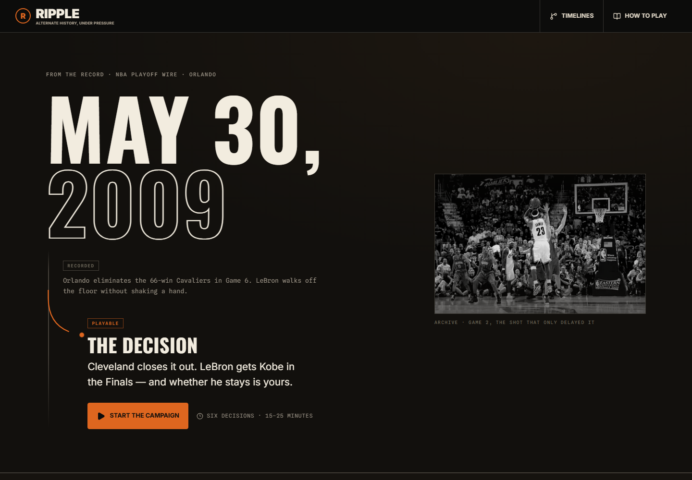

# RIPPLE

Alternate history, under pressure.

[**Play at playripple.app**](https://playripple.app)



RIPPLE takes the NBA moments that decided everything after them and hands you the front office instead. Pick a divergence point, run six decisions, and live with the consequences. The record is written; yours isn't.

## The campaigns

Each campaign is a six-turn strategic simulation. You read the situation, spend intel to sharpen a forecast, commit a strategy, and carry the fallout forward — trust, team strength, and cap flexibility all move with your calls. Championships raise banners, and the final turn resolves your run into a legacy score, a letter grade, and an ending drawn from what actually happened.

| Campaign | Divergence | Recorded history |
| --- | --- | --- |
| The Decision | May 30, 2009 · Cleveland | Orlando eliminates the 66-win Cavaliers in the conference finals; LeBron leaves for Miami a year later |
| Basketball Reasons | Dec 8, 2011 · Los Angeles | David Stern vetoes the Chris Paul trade; Paul goes to the Clippers instead |
| The Loyalty Window | Jul 4, 2016 · Oklahoma City | Durant announces for Golden State; the Warriors win the next two titles |
| The Second Pick | Jun 26, 2003 · Detroit | The Pistons take Darko Milicic at No. 2 |
| The Rose That Grew from Concrete | Apr 28, 2012 · Chicago | Derrick Rose tears his ACL in Game 1 against Philadelphia |

The 2009 Cavaliers campaign holds the front page. All five campaigns live at `/stories`.

## Local development

Requirements: Node.js 22 or newer and npm 10 or newer.

```powershell
npm install
npm run dev
```

Open `http://localhost:3000`.

To play on a phone against the dev server, copy `.env.example` to `.env.local` and set `DEV_LAN_ORIGIN` to your machine's LAN address.

## Verification

```powershell
npm run lint
npm run typecheck
npm test
npm run test:e2e
npm run build
```

`npm run validate:stories` runs only the story migration and graph-contract tests.

Verify mobile layout changes against a production build (`npm run build` then `npm start`), not the dev server — dev stylesheet ordering is not stable and will lie to you about which rule wins.

## Design language

The public pages encode one idea: **recorded history versus the playable branch.**

- **Gray mono is the record.** Every real date and outcome is set in Spline Sans Mono under a `RECORDED` tag. Archival photographs render in grayscale.
- **Orange is playable.** Tags, branch marks, and action buttons only — never decoration. Pressing an orange control means stepping off the record.
- **The fork is the signature.** `ForkBranch` draws a gray timeline spine splitting into an orange branch, and it animates on load.

Display type is Oswald; body is Inter. All three faces load through `next/font`.

### Brand assets

The link-preview card and the site icons are generated, not hand-drawn:

```powershell
npm run brand
```

That renders `scripts/brand-assets.html` in a real browser and writes `opengraph-image.jpg`, `icon.png`, and `apple-icon.png` into `src/app/`, where Next wires them into metadata automatically. Edit the art in `scripts/brand-assets.html` and re-run — never hand-edit the output.

Re-run it when the homepage's featured divergence changes (a different campaign on the front page, or reworded hero copy) and keep `FEATURED` in `scripts/brand-assets.mjs` in step with `src/components/home-hero.tsx`. Restyling and copy elsewhere on the site don't affect these files.

It renders in Chromium rather than through `next/og` because Satori can't draw `-webkit-text-stroke`, and the hollow year is the most identifying mark in the design.

## Project structure

- `src/app/` — routes and global design tokens
- `src/components/` — homepage, campaign index, play, result, and Creator Studio interfaces
- `src/components/campaign/campaign-mobile.css` — **the only** home for the play page's mobile styles; adding them to `globals.css` instead creates stylesheet-order conflicts
- `src/content/` — validated seed content and the playable campaign registry (`campaigns.ts`)
- `src/lib/campaign/` — campaign contract, deterministic state, risk, negotiation, scoring, and endings
- `src/lib/play/` — deterministic local play-session state and world-state evaluation
- `src/lib/stories/` — versioned narrative schema and validation
- `src/lib/creator/` — local drafts, ownership, workflow, validation, and versioning
- `supabase/migrations/` — Postgres schema migrations
- `e2e/` — Playwright flows and layout regression specs
- `artifacts/` — visual verification captures
- `checklists/` — build notes; open ideas live in `feedback-backlog.txt`
- `legacy/` — the original static prototype, preserved

## Database

**Supabase is not connected in production.** The migration in `supabase/migrations/202607130001_phase_1_foundation.sql` is scaffolded for a future account-backed version of RIPPLE; the deployed app does not query Supabase or PostgreSQL. Current play sessions and Creator Studio drafts are local-only and persist in the browser with `localStorage`.

The scaffold enables row-level security but intentionally defines no access policies. Before any Supabase client is connected, authenticated workflows and least-privilege policies must be implemented and tested.

## Content rule

Published playthroughs are pinned to immutable `story_versions` records. Editing a published story creates a new version, so existing shared timelines never change underneath the people playing them.

## Creator Studio

Creator Studio is built — guided story setup, a visual decision graph, state and consequence inspectors, autosave and recovery, full play preview, validation, and immutable publishing with versioning and remix attribution — but it is not part of the public site. Ownership and storage are browser-only today. Account-backed ownership, shared publishing, and community discovery are the work that would open it up.
